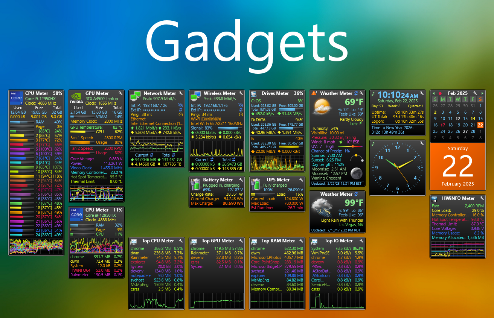

# Gadgets
**System monitoring gadgets inspired by the well-known AddGadgets.com Windows Sidebar gadgets.**

Arguably, some of the best and most popular Vista and Windows 7 Gadgets for system monitoring were done by [AddGadgets.com](http://addgadgets.com/). Unfortunately, with the deprecation of the Gadget platform and outright banning of gadgets by some corporate policies, these gadgets have become obsolete. Gadgets aren't supported in Windows 8 or Windows 10 without hacks and workarounds and often they break after applying Windows Updates.

Rainmeter is a free, open-source application for Windows PCs. It is a platform that enables skins to run on the desktop. I've taken the most widely used AddGadgets.com gadgets and re-imagined them in a new suite of Rainmeter Gadgets.

###### Get help on the Rainmeter forums
[![Rainmeter Forum](https://img.shields.io/static/v1?label=Rainmeter%20Forum&message=Gadgets&colorA=f0f0f0&colorB=2a6e9b&style=flat-square&logo=data%3Aimage%2Fpng%3Bbase64%2CiVBORw0KGgoAAAANSUhEUgAAAAsAAAAQCAYAAADAvYV%2BAAAABHNCSVQICAgIfAhkiAAAAAlwSFlzAAAESwAABEsBbzH2CgAAABl0RVh0U29mdHdhcmUAd3d3Lmlua3NjYXBlLm9yZ5vuPBoAAAH6SURBVCiRhdJPSJNhHAfw7%2FO8z%2Fu8%2F3w3bW05WVlr4XRzyw0iFRfF7FIepD8UQn9Mq8MWBnXpsPDapVuhyyKKqE4lHSoKqUPUwYQkgkqtiBAcCTU22db7dLFyueh3%2FPHh%2B%2BUHP6DCNCTS6yrt6d8LX%2FKyU2HSS39iqPm%2F2KXLF7aHvKajSr8BCPJPHDwx3GbT1c4z3TGpub62PnLq6qHKeM9tydS0a6ldW%2ByUEJze2W5yKp3bOHClehmOrM72tW7wOJs8TgCAw9Swvz1oU7g0WIajR4dkzthgfzxqLq3d1xbkFDgQOn7R9RtbVXJfrHGt7q4us1Bkhp6OsG7YjdQiFoQzluqPR8rlr1M2N3EI9PiS123Un0zH%2FHUOvlLnKH5%2BCuvbp2XpnWGfrEuFvUzjfNvWgLcm%2FyyFwtQdAAR8fRfUyACo4YY1%2FxaxBo8x9npmB5MAVZYoIbK2mCVQmBpFYfoeqOEGkRSwlhGACJXmiqWHD169n1eCvSDc9qdfWLCyX6C2JPB4ciaXzRdGpbkXdz%2Fooee77XaXK9RxmArLAmEq2KootNazmMh7xcjY%2BGwmI44QAAicvLTC5PxReE2tt3tTo72uxkTmew73J95ln7z5OJcrleKT53unlzyKIIFEusthMw5aQtRTgtmv2YVbysKPm%2BPDx4oA8BMJrI6FKL9sKAAAAABJRU5ErkJggg%3D%3D)](https://forum.rainmeter.net/viewtopic.php?f=130&t=20699)

## Features
#### All CPU Meter
 
* Displays CPU utilization for an unlimited number of CPUs and processors with up to 64-cores/128-threads each.**\***
* Supports [symmetric multiprocessing](https://docs.microsoft.com/en-us/windows/win32/procthread/multiple-processors) (SMP) and [non-uniform memory access](https://docs.microsoft.com/en-us/windows/win32/procthread/numa-support) (NUMA) architectures (skins for up to 4 CPUs or 4 NUMA nodes are provided, but more can be added).**\***
* Displays processor model and clock speed.
* Shows used, free, and total RAM available (per CPU or NUMA node if applicable).
* Shows used, free, and total page file available (optional).
* Shows core temperatures (optional, requires [CoreTemp](http://www.alcpu.com/CoreTemp/), [SpeedFan](http://www.almico.com/speedfan.php), or [HWiNFO](http://www.hwinfo.com); more info [here](https://github.com/SilverAzide/Gadgets/wiki/HOW-TO-Configure-the-All-CPU-Meter-to-show-core-temperatures#how-to-configure-the-all-cpu-meter-to-show-core-temperatures)).
* Shows CPU fan speed (optional, requires [SpeedFan](http://www.almico.com/speedfan.php) or [HWiNFO](http://www.hwinfo.com); more info [here](https://github.com/SilverAzide/Gadgets/wiki/HOW-TO-Configure-the-All-CPU-Meter-to-show-fan-usage#how-to-configure-the-all-cpu-meter-to-show-fan-usage)).**\***
* Displays graphical line chart of CPU utilization, with RAM and page file percent usage (optional).
* Shows Task Manager or Resource Monitor when gadget is double-clicked.
* Scales to any desired size.

#### Battery Meter
 
* Displays the current battery status, including time remaining and current percentage remaining.
* Shows current voltage, charge and discharge rates, current and maximum charge capacity.
* Shows battery manufacturer/model.
* Displays power in either watts or milliamps.
* Supports automatic failover on systems having multiple batteries.**\***
* Shows Power Options when gadget is double-clicked.**\***
* Scales to any desired size.

#### Calendar
   
* Based on [LuaCalendar](https://smurfier.github.io/LuaCalendar/), styled to match the Gadget suite.**\***
* Supports localized month/day names automatically.
* Supports multiple appearance options similar to the original Windows Sidebar gadget: calendar only, calendar with large date, and large date.
* Scales to any desired size.

#### Chronometer
 
* Digital Clock displays time, date, day, week, and quarter of the year.
* Shows computer uptime and session logon time (optional).
* Shows event countdown with customizable sound (optional).
* Includes configurable chime and multiple alarms with customizable sounds (optional).
* Supports Windows localized or custom time and date formats.
* Supports world times, can be adjusted for time zones and daylight saving time.**\***
* Supports having multiple clocks to allow monitoring time in multiple locations ([info](https://github.com/SilverAzide/Gadgets/wiki/HOW-TO-Create-multiple-Chronometers#how-to-create-multiple-chronometers)).
* Scales to any desired size.
* Includes Analog Clock variant, styled to match the Gadget suite.**\***
* Includes analog clocks ported from the original Windows Vista/Windows 7 Sidebar gadgets.

#### Drives Meter
 
* Displays disk information for up to 26 logical drives (fixed and removable only). Gadget dynamically adjusts to handle adding and removing drives.
* Shows used, free, and total disk space available.
* Displays percent disk utilization for each drive, plus the total.
* Shows throughput for each drive (read and write).
* Shows total bytes read/written since bootup for each drive on mouseover (optional).**\***
* Displays disk throughput graph (optional).
* Displays disk time percentage histogram (optional).
* Drive space bar graph changes color when disks are nearing capacity.**\***
* Shows Explorer when gadget is double-clicked.
* Opens drive in Explorer (or runs any user-defined command) when disk label is clicked.**\***
* Scales to any desired size.

#### GPU Meter
 
* Displays GPU model and clock speed (requires [HWiNFO](http://www.hwinfo.com); more info [here](https://github.com/SilverAzide/Gadgets/wiki/HOW-TO-Configure-the-GPU-Meter#how-to-configure-the-gpu-meter)).
* Shows used, free, and total RAM available, with memory clock speed.
* Shows GPU temperature, core load, and core voltage.
* Shows GPU fan speed and percent utilization (optional).
* Displays graphical line chart of RAM, core load, temperature, and fan usage (optional).
* Multiple GPU Meters provided to allow monitoring more than one GPU (for dedicated GPUs and 2-way SLI-equipped systems; for 4-way SLI systems, see [this](https://github.com/SilverAzide/Gadgets/wiki/HOW-TO-Configure-the-GPU-Meter-to-monitor-multiple-GPUs#how-to-configure-the-gpu-meter-to-monitor-multiple-gpus)).**\***
* Scales to any desired size.

#### Network Meter
 
* Shows data for all or selected network interfaces ([info](https://github.com/SilverAzide/Gadgets/wiki/INFO-Network-statistics-monitoring#info-network-statistics-monitoring)).
* Displays internal and external IP addresses (optional).
* Displays peak network throughput.**\***
* Shows inbound and outbound throughput in bits/sec and bytes/sec.
* Displays graphical chart of inbound and outbound network activity (optional). Does not require guesstimating your network speed, chart dynamically scales to handle both LAN and WAN traffic.
* Shows statistics for the current session and the total to date (optional).
* Indicates internet connectivity.
* Animated network icon shows network activity (in/out/both/neither/disconnected).**\***
* Performs external IP address and location lookup.
* Shows Network and Sharing Center when gadget is double-clicked.
* Includes dedicated Wireless Network gadget for monitoring wireless activity.
* Scales to any desired size.

#### Network Meter Pro
A precision network monitor with all the features of Network Meter, plus:
* More accurate network interface statistics monitoring, including data when Rainmeter is not running or no user is logged into the system.
* Not affected by Rainmeter restarts/refreshes.
* Not affected by network adapter configuration changes.
* Includes dedicated Wireless Network Pro gadget for monitoring wireless activity.
* Note: Requires installation of a Windows service (included).

#### Top Process Meter
 
* Displays 1 to 10 top processes, ordered by CPU/GPU/RAM/IO utilization.**\***
* Displays the amount of memory used by each process.
* Displays graph of total CPU/GPU/RAM/IO utilization (optional).
* Shows Resource Monitor when gadget is double-clicked.
* Scales to any desired size.

#### Weather Meter
 
* Displays the current weather for any location from [The Weather Channel](http://www.weather.com/). _Does NOT use the deprecated Wxdata feed_.
* Displays data in metric or imperial units.
* Shows current temperature, forecast high and low temperatures, "feels like" temperature, current conditions, current location and station, humidity, visibility, barometric pressure, wind speed, wind direction, and chance of precipitation.
* Shows current sunrise and sunset times, day length, and sun dial.
* Shows current moonrise and moonset times, moon phase and description, and moon dial.
* Shows moon zenith angle (tilt) and percentage illumination.**\***
* Shows complete 5 day forecast in a "flyout" window.
* Shows severe weather alerts for the current location.**\***
* Opens weather radar map for the observation location when location name is clicked.**\***
* Optional space-saving compact mode; gadget expands to full size on mouseover.
* Includes additional language translations: Bulgarian, Catalan, Czech, Dutch, English, Finnish, French, German, Hebrew, Hungarian, Italian, Korean, Polish, Portuguese, Romanian, Russian, Serbian (SP), Slovak, Spanish (SP), Swedish, Ukrainian ([info](https://github.com/SilverAzide/Gadgets/wiki/HOW-TO-Change-the-default-language-or-temperature-units-of-the-Weather-Meter#how-to-change-the-default-language-or-temperature-units-of-the-weather-meter), source [here](http://fav.me/d2ylush)).
* Supports having multiple Weather Meters to allow monitoring more than one location ([info](https://github.com/SilverAzide/Gadgets/wiki/HOW-TO-Configure-the-Weather-Meter-to-show-multiple-locations#how-to-configure-the-weather-meter-to-show-multiple-locations)).
* Scales to any desired size.

#### Welcome
 
* When the Gadgets are installed, the Welcome gadget will be loaded. Use this to toggle Gadgets on and off and to enable the Update Checker.

#### Update Checker
* Automatically checks for and optionally installs new Gadgets releases (enable/disable from the Welcome gadget).

#### ...get even more Gadgets!\*
* [Clipboard Meter](https://github.com/SilverAzide/Clipboard-Meter/#readme)
* [Stopwatch](https://github.com/SilverAzide/Stopwatch/#readme)
* [Weather Meter for Yahoo](https://github.com/SilverAzide/Weather-Meter-Yahoo/#readme)

**\*** Feature not part of original AddGadgets.com gadgets.

## Requirements
[Rainmeter 4.5.7 or later](https://www.rainmeter.net). 
[.NET Framework 4.8 or later](https://dotnet.microsoft.com/download/dotnet-framework/net48). 
GPU Meter requires [HWiNFO 7.02 or later](https://www.hwinfo.com). 
Top GPU Meter requires Windows 10 Fall Creator's Update (v1709) or later.

**Optional** 
CPU Meter can use either [HWiNFO 7.02 or later](https://www.hwinfo.com), [CoreTemp](https://www.alcpu.com/CoreTemp/) or [SpeedFan](http://www.almico.com/speedfan.php) to report temperatures and/or fan speeds.

## Attribution
* All CPU Meter gadget based on [All CPU Meter](https://forum.rainmeter.net/viewtopic.php?f=27&t=18381) by james31231.
* Calendar gadget is [LuaCalendar 6.0](http://smurfier.github.io/LuaCalendar/) by Smurfier, with [scaling enhancement](https://forum.rainmeter.net/viewtopic.php?f=5&t=38166#p196001) added by [Eclectic-Tech](https://www.deviantart.com/eclectic-tech), with localization and style mods by me.
* Chronometer and Network Meter gadgets use techniques from the System and Network skins in [JSMeter10](https://github.com/jsmorley/JSMeter10) by JSMorley.
* Update Checker gadget based on [ModernGadgets](https://github.com/raiguard/ModernGadgets/#readme) Update Checker by raiguard.
* Weather Meter gadget uses the [Weather.com](https://forum.rainmeter.net/viewtopic.php?f=27&t=34734) JSON V3 include templates by JSMorley.
* Weather Meter gadget includes translations from [VClouds Weather 2](http://fav.me/d2ylush) by VClouds.
* Weather Meter gadget uses weather icons by JSMorley (and others) with modifications by me.
* Weather Meter gadget uses a Lua script from [Sunset-Moonrise](http://fav.me/d5ybxqr) by Mordasius to calculate sun/moon times, with moon position/illumination code from [ModernGadgets](https://github.com/raiguard/ModernGadgets) by raiguard with [tweaks by Mordasius](https://forum.rainmeter.net/viewtopic.php?f=5&t=35896&start=30#p182152) and me.
* Welcome gadget uses the [ConfigActive](https://forum.rainmeter.net/viewtopic.php?f=18&t=28720) plugin by JSMorley.
* Gadgets includes [ColorPickerPlus](https://github.com/raiguard/ColorPickerPlus/#readme) by raiguard, with modifications by me.
    * ColorPickerPlus uses the [CursorColor](https://github.com/jsmorley/PluginColorCursor/#readme) plugin by JSMorley.
    * ColorPickerPlus uses the [Mouse](https://github.com/NighthawkSLO/Mouse.dll/#readme) plugin by NighthawkSLO.
* Additional code cleanup and tweaks by Milamber33.

## License
Creative Commons Attribution-NonCommercial-ShareAlike 4.0 International ([CC BY-NC-SA 4.0](https://creativecommons.org/licenses/by-nc-sa/4.0/))

---

